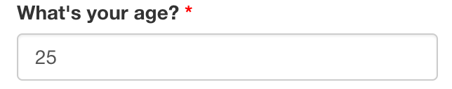
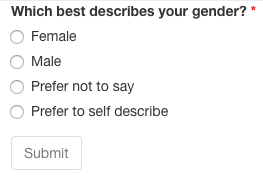
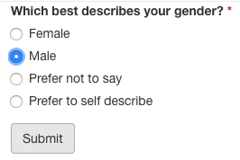

# {shinysurveys} {#shinysurveys}

## What is {shiny}? {#what-is-shiny}

### Technical Aspects {#technical-aspects-shiny}

Websites are predominantly built using three languages, HTML, CSS, and JavaScript, as described in the following figure.

:::: {.center data-latex=""}

{style="max-width: 100%;"}

::::

At a high-level, {shiny} allows programmers to combine the computational strengths of R with the interactivity of web applications. {shiny} does this through a curated set of functions that generate the HTML, CSS, and JavaScript necessary to create web applications [@hadleywickham2020].

A simple {shiny} app consists of two elements: `ui` (user-interface) and `server`. The former, defines what an individual will see when they visit the application and the latter defines what happens when a user interacts with the program. For example, you can define a simple application that accepts a name, adds a greeting, and displays the result using a few lines of code:

```{r shinyapp-textInput-code, eval = FALSE}
# load the package
library(shiny)
# define a user-interface with two elements: a text input with an ID, 
# label, and initial value; define a textOutput that 
# returns the input + greeting
ui <- fluidPage(
  textInput(inputId = "nameInput", 
            label = "What is your name?", 
            value = "World"),
  textOutput("name")
)
# define the server side logic to manipulate the inputs
server <- function(input, output, session) {
  # define the output that concatenates the strings 
  # "Hello, " + user input + "."
  output$name <- renderText({paste0("Hello, ", input$nameInput, ".")})
}
# run the application
shinyApp(ui, server)
```

When run in a browser, this code produces the following application:

```{r shinyapp-textInput-gif, include = knitr::is_html_output(), echo = FALSE}
knitr::include_graphics(here::here("graphics/shinysurveys/shinyapp_textInput.gif"))
```

```{r shinyapp-textInput-png, include = knitr::is_latex_output(), echo = FALSE, fig.align='center', out.width='90%'}
knitr::include_graphics(here::here("graphics/shinysurveys/static-textInput/combined.png"))
```

### Usage {#usage}

::: {.blockquote data-latex=""}

{shiny} is "used in almost as many niches and industries as R itself is" [@hadleywickham2020].

::: 

{shiny} is used in many disciplines. For example, DePalma, Turnidge, and Craig (2017) developed an app that allows physicians to utilize complex mathematical methods of determining microbial resistance to antibiotics [@depalma2017].

Similarly, Kandlikar and colleagues (2018) developed a program, *ranacapa*, to explore environmental DNA sequences that is used to engage and educate professionals and students alike. It allowed resource managers at the Channel Islands National Park Service to filter their observed species down to "a particular set of key taxa that they regularly monitor" and allowed students with "no prior bioinformatics experience" to gain an understanding of their eDNA samples, allowing their instructors to focus on "biological questions rather than on troubleshooting bioinformatics problems" [@kandlikar2018].

These two examples serve to illustrate the effectiveness of allowing people to interact with R. The next section describes the specific motivation for {shinysurveys}.

## Motivation {#motivation}

Surveys are useful tools for gathering information from individuals on a large scale and are used in a variety of domains. Within the medical research field, for example, they may be epidemiological questionnaires (e.g. have you received your COVID-19 Vaccine). In neuroscience research, they are often used to correlate behavioral or psychological measures, such as political ideology, with neuroimaging data [@ahn2014].

The ability to easily collect and analyze survey data is, therefore, incredibly important. Many platforms provide user-friendly methods to do this. [Google Forms](https://www.google.com/forms/about/), [SurveyMonkey](https://www.surveymonkey.com/), and [Qualtrics](https://www.qualtrics.com/core-xm/survey-software/) are all popular options. For many cases, they work very well. However, these services don't always integrate easily with existing data analysis and/or research pipelines. Because of R's prevalence in academia and research [@rstudio2018a; @carson2016], {shinysurveys} was developed to streamline the data collection and analysis process. It is built upon the {shiny} package [@chang2021] previously described.

## A survey of {shinysurveys} {#survey-of-shinysurveys}

```{r setup, message = FALSE, echo = FALSE}
library(shinysurveys)
library(tibble)
library(kableExtra)
```

A clear example of a survey is a simple demographic form. {shinysurveys} allows you to easily create questionnaires like these with {shiny}.[^shinysurveys-1] This vignette introduces you to the main functionality of {shinysurveys} as it is  published on CRAN.[^shinysurveys-2] Recalling the basic structure of a {shiny} application, consisting of the user-interface and server components, my package has a function for each: `surveyOutput()` and `renderSurvey()`, respectively. Both accept a data frame containing question information that follows a specific format. To illustrate them in use, I will show you a questionnaire from a recent study conducted by the [D'Agostino McGowan Data Science Lab](http://dmds.lucymcgowan.com/) that is built into the `shinysurveys` package.[^shinysurveys-3] The first ten (of 54) rows of this data frame look like:

[^shinysurveys-1]: I assume familiarity with the basic layout of a Shiny application, as briefly outlined above. For additional information, please check out RStudio's [great resources](https://shiny.rstudio.com/tutorial/).

[^shinysurveys-2]: The version discussed was published on CRAN, the Comprehensive R Archive Network, on February 19th, 2021. The development version, hosted on GitHub, contains new features and can be [accessed here](https://github.com/jdtrat/shinysurveys/).

[^shinysurveys-3]: In the following code, I use the prefix `shinysurveys::` whenever I'm using a function specific to this package. If you are unfamiliar with this notation, see [[@rpkgs]](https://r-pkgs.org/namespace.html)

```{r, echo = FALSE}
shinysurveys::teaching_r_questions %>% 
  dplyr::slice(1:10) %>%
  kableExtra::kbl(format = 'latex', booktabs = TRUE) %>%
  kable_styling(latex_options = c("striped", "scale_down"), position = "center")
```

This data can be described as a tidy data frame, where each row is a unique observation and each column is a variable. While the full table consists of 54 rows, there are only 11 unique questions:

```{r display unique questions, echo = FALSE}
data.frame("unique_questions" = unique(shinysurveys::teaching_r_questions$question)) %>%
  dplyr::rename_with(snakecase::to_title_case, unique_questions) %>%
  kableExtra::kbl(format = 'latex', booktabs = TRUE) %>%
  kable_styling(latex_options = c("striped", "scale_down"), position = "center")
```

The reason for the discrepancy between the number of rows and unique questions derives from the fact that certain questions can have more than one possible response. For example, the multiple choice question asking about gender has four options: "Female", "Male", "Prefer not to say", or "Prefer to self describe." It thus has four rows, one per each option.

To create a question in the required format, seven parameters must be supplied. They are described in the package documentation and can be accessed by typing `?shinysurveys::teaching_r_questions` in the R console:

-   *question*: The question to be asked.
-   *option*: A possible response to the question. In multiple choice questions, for example, this would be the possible answers. For questions without discrete answers, such as a numeric input, this would be the default option shown on the input. For text inputs, it is the placeholder value.
-   *input_type*: What type of response is expected? Currently supported types include `numeric`, `mc` for multiple choice, `text`, `select`,and `y/n` for yes/no questions.
-   *input_id*: The input id for Shiny inputs.
-   *dependence*: Does this question (row) depend on another? That is, should it only appear if a different question has a specific value? This column contains the input_id of whatever question this one depends upon.
-   *dependence_value*: This column contains the specific value that the dependence question must take for this question (row) to be shown.
-   *required*: logical TRUE/FALSE signifying if a question is required.

The next section describes input types native to {shinysurveys}.

### Examples

Below are examples of the currently supported question types. I provide a thorough explanation for the numeric input, but only point out notable differences for other inputs.

#### Numeric Input

A good example of a numeric input is the first question: "What's your age?":

```{r what is your age preview, echo = FALSE}
subset(teaching_r_questions, input_id == "age") %>%
  kableExtra::kbl(format = 'latex', booktabs = TRUE) %>%
  kable_styling(latex_options = c("striped", "scale_down"), position = "center")
```

As seen above, this row corresponds to the question "What's your age?". I know to expect a numeric response by looking at the `input_type` column, and the default value is equal to 25 according to the `option` column.[^shinysurveys-4]

[^shinysurveys-4]: It is important to note that the option column for numeric inputs provides the default value, but for other types -- as I will show -- it provides the possible options for a question.

I can also tell that there are no dependency questions. This means that no matter what value is entered, no follow-up question will appear. Lastly, I know it is a required question.[^shinysurveys-5]

[^shinysurveys-5]: Required question functionality will be discussed in more detail in the section [Required Questions](#required_questions).

:::: {.center data-latex=""}

{style="display: block; margin: 1em auto" width="300"}

::::

#### Multiple Choice (mc) Input {#multiple_choice}

An example of this is the question "Which best describes your gender?":

```{r what is your gender mc, echo = FALSE}
subset(teaching_r_questions, input_id == "gender" | input_id == "self_describe_gender") %>%
  kableExtra::kbl(format = 'latex', booktabs = TRUE) %>%
  kable_styling(latex_options = c("striped", "scale_down"), position = "center")
```

Unlike numeric inputs, the `option` column represents each of the possible responses for this question. You may notice that the fifth row of this question has *NA* in the `option` column and "text" in the `input_type` column. I will discuss this in more detail [below](#dependency-questions), but for now, note that this question has a dependent. That is, if a specific option is chosen for this question, a new one will appear below. In this case, a question that accepts text as its input.

:::: {.center data-latex=""}

{style="display: block; margin: 1em auto" width="300"}

::::

#### Text Input {#text_input}

Questions that need text-based input should specify "text" in the `input_type` column. As noted in the previous example, the following is a dependent of the question "Which best describes your gender?":

```{r what is your gender text, echo = FALSE}
subset(teaching_r_questions, input_id == "self_describe_gender") %>%
  kableExtra::kbl(format = 'latex', booktabs = TRUE) %>%
  kable_styling(latex_options = c("striped", "scale_down"), position = "center")
```

As previously mentioned, the `option` column for text-based inputs corresponds to a placeholder value. It can be left blank (i.e. NA) or contain a character string. If they are left empty, the text field will display "Placeholder" as seen below. Otherwise, the character string will be displayed.

:::: {.center data-latex=""}

{.center style="display: block; margin: 1em auto" width="300"}

{.center data-latex="" style="display: block; margin: 1em auto" width="290" height="71"}

::::

#### Select Input

Select inputs are great when there are many potential, discretely defined, response choices.[^shinysurveys-6] An example is the question "What was your first language?" which contains `r nrow(subset(teaching_r_questions, question == "What was your first language?"))` options:

[^shinysurveys-6]: As of May 2021, these do not support multiple options selected at once, though I anticipate adding this functionality in the future.

```{r show first language options, echo = FALSE}
subset(teaching_r_questions, question == "What was your first language?") %>% kableExtra::kbl(format = 'latex', booktabs = TRUE) %>%
  kable_styling(latex_options = c("striped", "scale_down"), position = "center")
```

:::: {.center data-latex=""}

{style="display: block; margin: 1em auto" width="300"}

::::

#### Yes or No (y/n) Input

Yes or no questions are self-explanatory. An example is the question "Have you ever learned to program in R?":

```{r learned to program in R, echo = FALSE}
subset(teaching_r_questions, input_id == "learned_r") %>% kableExtra::kbl(format = 'latex', booktabs = TRUE) %>%
  kable_styling(latex_options = c("striped", "scale_down"), position = "center")
```

:::: {.center data-latex=""}

{style="display: block; margin: 1em auto" width="300"}

::::

With an understanding of the available input types, I will now discuss how to implement a survey using this package.

### Implementing Surveys in Shiny

#### UI Function

`surveyOutput()` takes in a data frame of the form described above. You may also add a title and description for your survey with the arguments `survey_title` and `survey_description`, though these are optional. Further documentation can be accessed by typing `?shinysurveys::surveyOutput()` in the console.

#### Server Function

`renderSurvey()` takes in a data frame of the form described above. It also takes in a `theme` color to style your survey. Typical names such as "red" or "blue" work, as well as hex color codes such as "\#63B8FF" (the default theme). The documentation for it can be accessed by typing `?shinysurveys::renderSurvey()` in the console.

#### Basic Survey

A minimal example of a survey can be created with this template:

```{r run survey, eval = FALSE}
library(shinysurveys)
ui <- shiny::fluidPage(
  shinysurveys::surveyOutput(df = shinysurveys::teaching_r_questions,
                             survey_title = "A minimal title",
                             survey_description = "A minimal description")
)

server <- function(input, output, session) {
  shinysurveys::renderSurvey(df = shinysurveys::teaching_r_questions)
}

shiny::shinyApp(ui = ui, server = server)
```

This creates a functioning survey that looks like this:


:::: {.center data-latex=""}

{style="display: block; margin: 1em auto" width="500"}
::::

However, when a participant submits their results, nothing happens. By
design, {shinysurveys} is minimalist. An extension of this is not
imposing any requirements for submission actions, but rather allowing
the survey designer to customize them.

More specifically, the user-interface includes a "submit" button (not
shown in the above picture) that requires the programmer to define what
happens when it is pressed. Some examples would be saving or displaying
user responses, or displaying a message as seen on the [gif
here.](https://www.jdtrat.com/packages/shinysurveys/index.html#demos)

### Advanced Features

#### Dependency Questions {#dependency-questions}

I use the term question dependencies in reference to the situations where a question should only be shown (i.e. asked) if a specific response is given to a preceding question. The questions included with the {shinysurveys} package contain many dependencies. One example I I mentioned when discussing [multiple choice](#multiple_choice) and [text-based](#text_input) questions is the dependent for "Which best describes your gender?"

```{r what is your gender - question dependencies, echo = FALSE}
subset(teaching_r_questions, input_id == "gender" | input_id == "self_describe_gender") %>%
  kableExtra::kbl(format = 'latex', booktabs = TRUE) %>%
  kable_styling(latex_options = c("striped", "scale_down"), position = "center")
```

Focusing on the columns `dependence` and `dependence_value`, the text-based question will only show if the multiple choice one, with the input id of "gender" takes on the value "Prefer to self describe." That is, a question with non *NA* values in the `dependence` and `dependence_value` columns will only show if the question with the input id from `dependence` takes on the value in `dependence_value`. This can be seen below:

:::: {.center data-latex=""}

{style="display: block; margin: 1em auto" width="300"}

{style="display: block; margin: 1em auto" width="300"}

::::

#### Required Questions {#required_questions}

Survey designers can define questions that must be answered by adding the value TRUE to the `required` column. If a required question is not answered, the user will not be able to submit their responses.

:::: {.center data-latex=""}

{style="display: block; margin: 1em auto" width="300"}

{style="display: block; margin: 1em auto" width="300"}

::::

#### User Tracking

Built into the survey is the ability to track users based on URL parameters. If you deploy your survey on [shinyapps.io](shinyapps.io), or run it locally in a browser, you can add a URL parameter after the backslash as follows: `?user_id=12345`. A live demo can be found here: <https://jdtrat-apps.shinyapps.io/shinysurveys_user_tracking/?user_id=hadley>

## Conclusion

{shinysurveys} was developed to integrate behavioral data collection into existing research and/or analysis pipelines in R. The package provides an easy-to-use, highly customizable framework for deploying surveys and questionnaires via web applications. By extending the {shiny} package, a shinysurvey can make use of the data manipulation and visualization tools in R, facilitating automated data analysis and real-time metrics for participant responses.

In its current implementation, {shinysurveys} is a powerful tool. Amazingly, as of May 11, 2021, the package has been downloaded over 1,000 times. The original idea for it was to provide a select set of well-supported input types commonly used in surveys. However, it was not designed to meet every use-case, and shortly after its release, new question-types were requested (see GitHub Issue [\#6](https://github.com/jdtrat/shinysurveys/issues/6) or [\#18](https://github.com/jdtrat/shinysurveys/issues/18)).

In order to make the package as light-weight as possible, minimizing the dependence on external code, I did not wish to implement any input types not native to {shiny}. While some additional inputs have been addressed in the development version, future work will focus on providing a method to extend available input types. The ability to expand {shinysurveys} with custom inputs, from packages such as [`{shinyWidgets}`](http://shinyapps.dreamrs.fr/shinyWidgets/), will allow users to administer more complex surveys.
