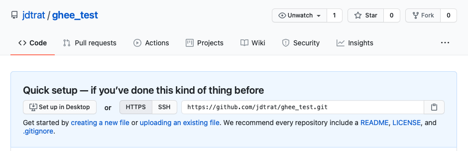

# {ghee}

## Version Control

Programming is an important skill used in academia and industry alike. A computational neuroscientist, for example, may need to develop code that combines neuroimaging data like fMRI with behavioral data, such as political ideology, in order to understand the relationship between neural processes and political attitudes -- e.g. [@ahn2014]. An industry professional may need to develop code that combines demographic data and purchasing history in order to predict future profits for a new product. Complex models and programs like these are often developed piecemeal by multiple individuals. Thus, if one person makes a change or implements a feature, it's essential that all collaborators have the latest version. It is equally essential that any change be revertible in case it introduces a bug to the existing code.

These requirements are met with a version control system (VCS), which allows you to track incremental changes to code. One may think of VCS as a more robust version of Microsoft Word's "Track Changes" feature. A popular VCS is called [git](http://git-scm.com), and is extremely popular with scientists and programmers alike [@blischak2016]. The next section discusses the basics of working with git and how to share your code with others using [GitHub](https://github.com), an online platform that hosts code that is version-controlled with git.

## git and GitHub

In order to version-control your code with git you must navigate to the folder containing your code and *initiate* a **repository**.[^ghee-1]

[^ghee-1]: This minimal introduction assumes git is installed on your computer. For a great "how-to", see the "Install Git" section from [@jennybryan].

```{r, echo = FALSE}
details::details(c("How should I cite the definition blocks? I wanted to include them because I found box 1 of [@blischak2016] useful, but I feel they are not explicitly citable from that?"), summary = "How to best cite these git definitions?")
```

::: {.definition}
A **repository** (or **repo**) is a folder containing all files to be version-controlled in their present and past forms.
:::

As an example, this thesis is currently version-controlled in a repo called "senior-thesis," which simply lives as a folder on my computer. This is the **local** repository. Whenever I make a change to a file, I **stage** those changes and **commit** them to my local repository.

::: {.definition}
A **local** repository is a folder of version-controlled files that lives on a personal computer.

To **stage** files is to highlight them as modified; typically comments are made about any changes for these files and a snapshot of them are **committed** to your local repo.
:::

Once I have committed (a snapshot of) my modified files to my local repo, I **push** those changes to a **remote** repository.

::: {.definition}
A **remote** repository is the version of your local repository stored on a remote server such as GitHub.

To **push** files is to send commits from a local repository to its remote repository.
:::

If someone wished to work on my thesis for me, they could **clone** the remote repository "senior-thesis", stage, commit, and push changes, and then I could **pull** them into my local repository, ensuring that our versions our consistent.

::: {.definition}
To **clone** a repository is to make a copy of a remote repository on a personal computer; that is, make a local repo from an remote one.\
To **pull** is to retrieve any commits (modifications) that are on a remote repository and update your local repo.
:::

With an understanding of some of the core features of git,[^ghee-2] one is ready to collaborate with others. This is often done using [GitHub](https://github.com/), which I will redescribe as an online host for git repositories. When I push an updated version of my thesis, others can view that (and previous versions) [on GitHub](https://github.com/jdtrat/senior-thesis). Because GitHub is a remote platform, it provides a version-controlled backup of my code (or thesis) in case something happened to my computer. On top of that, GitHub has extremely nice features for collaboration and productivity. A few features relevant to my thesis include:

[^ghee-2]: There are additional features of git that are outside the scope of this thesis. For those interested, I would recommend the book *Pro Git*, which is freely available [here](http://git-scm.com/book/en/v2) [@scottchacon2014].

```{r, echo = FALSE}
details::details(c("How should I cite these? They're from GitHub's website -- mainly https://github.com/features -- as well as personal experience"), summary = "How to best cite these GitHub Features?")
```

1.  **Issues**: A framework for collecting user feedback, reporting software bugs, tracking and prioritizing work, assigning responsibilities, and more.
2.  **Pull requests**: A method of pushing changes to a repository which requires approval by an owner. This facilitates discussions of potential changes before they are integrated into the repository.
3.  **Repository visibility:** A way to restrict who has access to a repository; public repos are available to anyone on the internet; private repos are only available to the owner and any individuals to whom they explicitly grant access; organization repos are available to people in specific organizations (groups).

For my research, I found myself utilizing these features of GitHub more often. I was constantly leaving my code editor, [RStudio](https://www.rstudio.com), opening up a browser, navigating to my repo-of-choice, and creating or commenting on issues, inviting people to a repository, etc. For this reason, I developed a package, {ghee}, that allows common GitHub tasks to be achieved directly from R. So, what exactly is {ghee}?

## What is {ghee}?

> {ghee} is a user-friendly wrapper for the {gh} package that provides client access to Github's REST API for common tasks such as creating issues and inviting collaborators.

### Technical Aspects

An Application Programming Interface (API) may be thought of as a channel provided by developers of proprietary software that allows individuals to access certain features. The R package [{googledrive}](http://googledrive.tidyverse.org/), for example, allows you to read, write, and manipulate files in your Google Drive account directly from R. In the same vein, GitHub's API allows you to perform [hundreds of actions](https://docs.github.com/en/rest/overview/endpoints-available-for-github-apps) involving repositories, organizations, billing, and more. The official GitHub API "Octokit" is provided for Ruby, .NET, and JavaScript, but there are implementations in many other languages from Clojure to Go, Haskell to Perl, Python and R.

For R, the package [{gh}](http://gh.r-lib.org/) provides extremely flexible API access to GitHub, though it requires the use of HTTP verbs such as `HEAD`, `GET`, and `POST` to perform actions. For R users who are familiar with web protocols, or those who don't mind exploring the documentation for API requests, {gh} is a wonderful package.

{ghee} is **not** meant to replace {gh} or be an exhaustive API. It is designed for R users, such as myself, who are less comfortable with web protocols but regularly interact with GitHub. That is, it was designed with the goal of helping developers achieve common tasks with GitHub easily. As such, all functions begin with the prefix `gh_`, followed by categories of actions such as `collab` and `issue`. An overview of the package is described in the next section.

## Clarifying Butter

I chose the name {ghee} for a couple reasons. One, my neighbor loves using ghee (clarified butter) to cook, and I have recently become a fan of it. Two, I think it makes it easy to switch between this package and its underlying one, {gh}, if you need to perform sophisticated API requests.

### Installation

The source code for {ghee} is [on my GitHub repo](https://github.com/jdtrat/ghee), and the development version of it can be installed and loaded as follows:

```{r, eval = FALSE}
# Install released version from CRAN
install.packages("ghee")

# Or, install the development version from GitHub
# install.packages("remotes")
remotes::install_github("jdtrat/ghee")

# Load package
library(ghee)
```

### What are use cases for {ghee}?

#### Collaboration

I've found it particularly helpful to use {ghee} when working with collaborators. Normally, to invite someone to a repo, I would have to navigate to its page on Github, go to settings, manage access, and send an invitation manually. With {ghee}, though, it's as simple as specifying the repo and the invitee:

```{r gh_collab_invite-individual, eval = FALSE}

gh_collab_invite(path = "owner/repository",
                 invitee = "bestfriend")
```

If you wanted to invite multiple friends at once, you could do so in a functional programming style. Here's an example with the [{purrr}](http://purrr.tidyverse.org/) package, which simply calls the `gh_collab_invite()` for each entry in the friends vector.

```{r gh_collab_invite-multiple, eval = FALSE}

friends <- c("friend", "pal", "amigo")
purrr::walk(.x = friends, 
            ~ gh_collab_invite(path = "owner/repository", 
                               invitee = .x))
```

#### Repositories

{ghee} provides functions to create, edit, and delete repositories. As an example, I'll create a repo called "ghee_test," as seen below.

```{r gh_repos_create, eval = FALSE}

# Create a Private Repo
gh_repos_create(path = "jdtrat/ghee_test", 
                private = TRUE, 
                description = "A test repository.")
```

{style="max-width: 100%;"}

Note how the above picture shows an "Issues" tab. I don't really want feedback on this repository, so I'm going to disable it with the `gh_repos_mutate()` function.

```{r gh_repos_mutate-issues, eval = FALSE}
# Disable Issues
gh_repos_mutate(path = "jdtrat/ghee_test", 
                has_issues = FALSE)
```

{style="max-width: 100%;"}

If you decide you don't want a private repo anymore, no problem! That's an easy change! In the picture below, you can see the private badge next to the title is gone.

```{r gh_repos_mutate-private, eval = FALSE}
# Change Privacy Settings
gh_repos_mutate(path = "jdtrat/ghee_test", 
                private = FALSE)
```

{style="max-width: 100%;"}

Now, I know what you're thinking. You don't like the repo name "ghee_test." I don't blame you. Let's change it! Voila! It's now "ghee_testing."

```{r gh_repos_mutate-name, eval = FALSE}
# Change Repo Name
gh_repos_mutate(path = "jdtrat/ghee_test", 
                name = "ghee_testing")
```

{style="max-width: 100%;"}

For more repository manipulation options, check out GitHub's API [here](https://docs.github.com/en/rest/reference/repos#update-a-repository). You can also look at the documentation for `gh_repos_mutate()`, which expands upon the above examples.

{ghee} also has a function to delete repositories, though it should be *used with caution*, as it is [**permanent**]{.ul}. Further, if you want to use it, you will need to create a special GitHub PAT with the [appropriate permissions](https://docs.github.com/en/github/administering-a-repository/deleting-a-repository). This can be done with the with the [{usethis}](http://usethis.r-lib.org) package as follows: `usethis::create_github_token(scopes = "delete_repo")`.

#### Issues

Another big component of GitHub are Issues. {ghee} includes some helper functions for interacting with them. These include, `gh_issue_list()`, `gh_issue_new()`, `gh_issue_comment()`, and `gh_issue_assign()`. The first function lists the GitHub issues for a specific repo. The next one allows you to create a new issue, and the other two allow you to comment on or assign existing ones. For example, if I wanted to create an issue for my [{shinysurveys}](https://github.com/jdtrat/shinysurveys) package discussed [elsewhere in this thesis](#shinysurveys), I could do so as follows:

```{r gh_issues_new, eval = FALSE}

gh_issue_new(path = "jdtrat/shinysurveys", 
             title = "My Issue Title", 
             body = "Just wanted to say I love your package!")

```

To assign that issue to myself, or respond to it, I would use the issue number (which I could get with `gh_issue_list()`) and do something like this:

```{r gh_issues_extra, eval = FALSE}

gh_issue_assign(path = "jdtrat/shinysurveys",
                issue_number = 5, 
                assignees = "jdtrat")

gh_issue_comment(path = "jdtrat/shinysurveys", 
                 issue_number = 5, 
                 body = "Thanks, @jdtrat!")
```

## Conclusion

As mentioned in the vignette, {ghee} was not developed to be an exhaustive API. It was designed to provide a curated set of functions to improve R user's workflow for common tasks with GitHub. From first-hand experience, I believe this goal has been achieved. Excitingly, it has been downloaded over 750 times as of May 11, 2021.

Even so, discussions within the R community[^ghee-3] have indicated a need for automating certain tasks not currently supported, such as relabeling GitHub Issues. While there are other alternatives for this, chiefly [{usethis}](https://usethis.r-lib.org/reference/index.html#section-git-and-github), I believe the R community could benefit from a common interface. Future work on {ghee} will focus on implementing additional features to improve user's interaction with GitHub.

[^ghee-3]: e.g. <https://twitter.com/henrikbengtsson/status/1392207996592087043?s=20>
